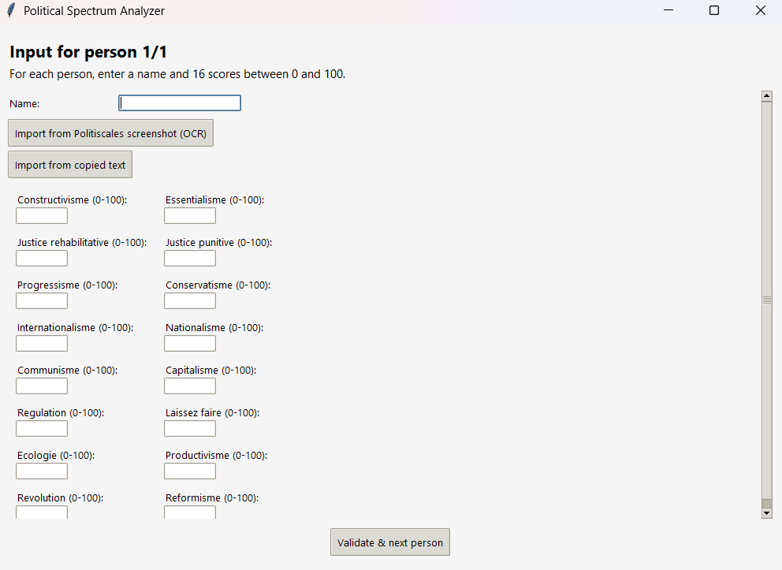
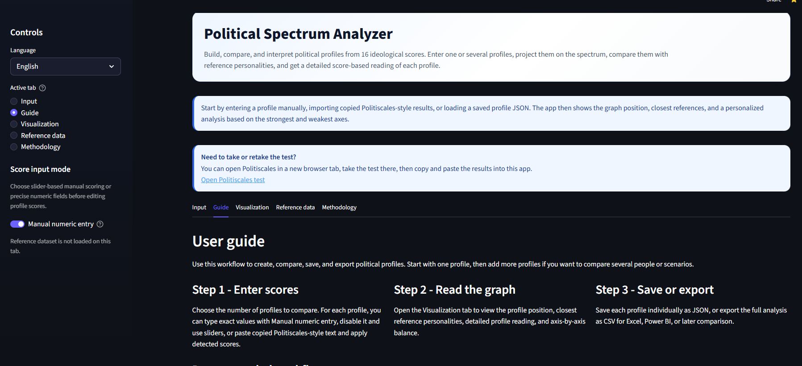
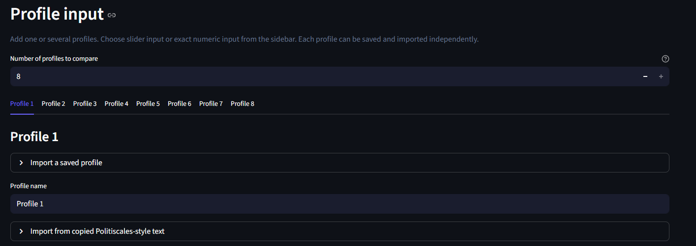
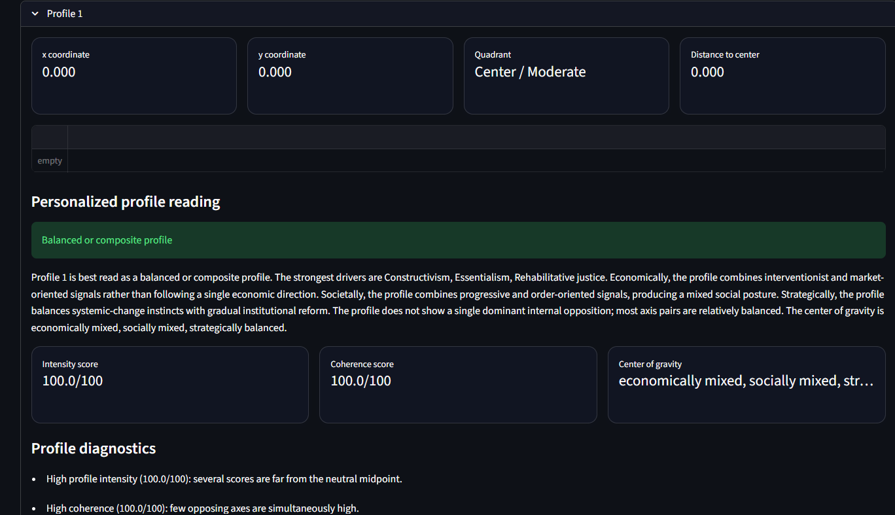
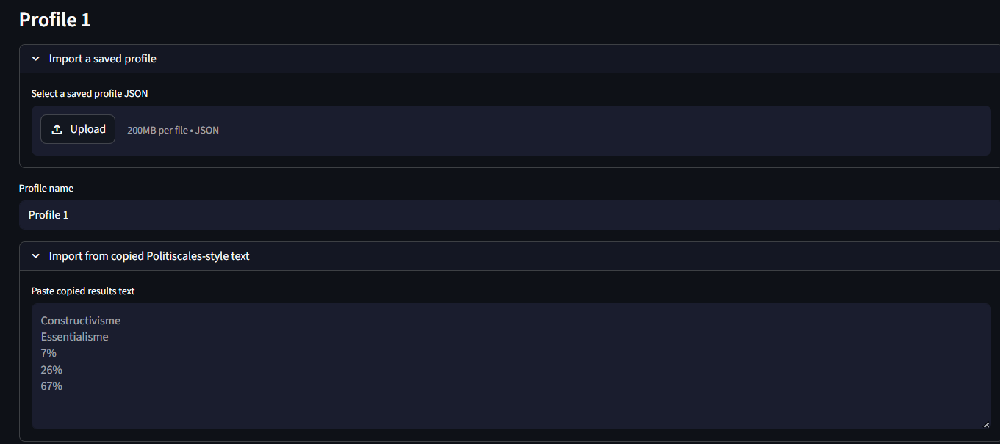

# Political Spectrum Analyzer

Political Spectrum Analyzer is a Python application for turning Politiscales-style scores into a readable political profile, a two-dimensional spectrum position, and comparisons with reference personalities.

This README is based on files present in this repository. It separates verified current behavior from legacy documentation anchors that are intentionally preserved for regression tests and historical documentation continuity.

Repository: `https://github.com/kenzi0228/political-spectrum-analyzer`

## Project overview

The project contains a Streamlit web interface, a desktop-oriented Python package, local reference datasets, interpretation services, Plotly visualization code, OCR utilities for desktop workflows, and a regression test suite.

Current verified status from local files:

- Desktop version: stable (`v1.0.0-desktop` is preserved as a documentation anchor).
- Streamlit version: deployment ready (`v1.1.0-streamlit` is preserved as a documentation anchor).
- The current coordinate methodology is scoring model v2.
- The reference dataset contains **500 profiles**.
- The license is a custom non-commercial license; commercial use is not permitted without prior permission.

## What the application does

The application supports the following repository-backed workflows:

- enter Politiscales-style scores manually or with sliders;
- import copied Politiscales-style text;
- open a direct link to the original Politiscales test from the Streamlit UI;
- compute `x` and `y` graph coordinates;
- show a Plotly default reference map when Plotly is available;
- filter reference personalities with multi-select reference filters;
- read detailed profile interpretation from the 16-axis score structure;
- compare several profiles, including profile comparison analysis;
- save and import profiles one by one with JSON;
- export structured results through CSV export paths.

The Streamlit UI includes an English and French interface. The Guide tab and the About / How to use page explain what the analyzer does, how to use it, and the difference between the desktop and web versions.

## Current repository status

The current local tree includes:

- `streamlit_app.py` for the web interface;
- `src/political_spectrum_analyzer/` for package code;
- `src/political_spectrum_analyzer/services/profile_interpretation_service.py` for detailed profile reading;
- `src/political_spectrum_analyzer/model/scoring_model_v2.py` for the current coordinate formula;
- `src/political_spectrum_analyzer/web/plotly_plot.py` for the Plotly reference-map helper;
- `data/reference/personalities.csv` for reference personalities;
- `data/reference/ideology_taxonomy.csv` and `data/reference/ideology_aliases.csv` for taxonomy support;
- `docs/assets/` for screenshot assets;
- `docs/streamlit_cloud_deployment.md` and `docs/streamlit_deployment.md` for deployment notes;
- `.streamlit/config.toml` for Streamlit configuration;
- `tests` for the regression suite.

Real Streamlit UI integration is tested by the repository. The current app calls the restored detailed analysis renderer (`_render_analysis`) instead of replacing it with the integrated v3 fallback renderer.

## Reference dataset

The current reference dataset contains **500 profiles** in `data/reference/personalities.csv`.

Verified local metadata:

- gender values: 352 `male`, 148 `female`, 0 `unknown`;
- ideology families: 31;
- role categories: 16;
- country label values: 143;
- split country tokens: 107;
- coordinate-audit rows: 7.

Reference dataset schema v2 is represented by `data/reference/personalities.csv`, `data/reference/ideology_taxonomy.csv`, and `data/reference/ideology_aliases.csv`. The schema avoids a `region` column and keeps metadata such as `country`, `country_codes`, `role_category`, `gender`, `century`, `confidence`, coordinates, source notes, and tags.

Reference dataset quality rules v2 are covered by tests for valid coordinate bounds, controlled confidence values, controlled gender values, non-empty country metadata, and 500 reference profiles.

Coordinate-audit artifacts:

```text
data/reference/profile_coordinate_audit.csv
docs/reference_dataset_profile_audit.md
```

## Scoring methodology

The current methodology is Scoring model v2. It builds weighted ideological blocks, compares opposite blocks, applies secondary adjustments, normalizes raw scores with `/ 120`, then maps the result into the graph range `[-4, 4]` with `sigmoid_scaled`.

Implementation:

```text
src/political_spectrum_analyzer/model/scoring_model_v2.py
```

Economic blocks:

```text
economic_left =
    0.90 * communisme
  + 0.70 * regulation
  + 0.35 * ecologie
  + 0.25 * revolution

economic_right =
    0.90 * capitalisme
  + 0.75 * laissez_faire
  + 0.25 * productivisme
  + 0.20 * reformisme
```

Social-authority blocks:

```text
social_libertarian =
    0.70 * constructivisme
  + 0.65 * justice_rehabilitative
  + 0.70 * progressisme
  + 0.50 * internationalisme

social_authoritarian =
    0.60 * essentialisme
  + 0.70 * justice_punitive
  + 0.70 * conservatisme
  + 0.50 * nationalisme
```

Raw axes and normalization:

```text
economic_raw = economic_right - economic_left
social_raw = social_authoritarian - social_libertarian

economic_raw += 0.12 * (productivisme - ecologie)
social_raw += 0.10 * (nationalisme - internationalisme)
social_raw += 0.08 * (revolution - reformisme)

economic_normalized = economic_raw / 120
social_normalized = social_raw / 120

x = 4 * sigmoid_scaled(economic_normalized)
y = 4 * sigmoid_scaled(social_normalized)
```

In the current V2 formula, `revolution` and `reformisme` are direct but secondary coordinate inputs. They are also used by the detailed strategic analysis.

## Web version - Streamlit

Deployment ready describes the repository state for a Streamlit deployment path, not a guarantee about the availability of an external service at any given moment.

Verified web files:

- `streamlit_app.py`;
- `.streamlit/config.toml`;
- `requirements.txt`;
- `docs/streamlit_cloud_deployment.md`.

Streamlit Community Cloud settings documented locally:

```text
Repository: kenzi0228/political-spectrum-analyzer
Branch: main
Main file path: streamlit_app.py
Python version: python-3.12
Dependency file: requirements.txt
```

OCR remains a desktop-only feature for web deployment. No packages.txt file is required because the Streamlit runtime intentionally excludes native Tesseract setup.

Live Streamlit demo documentation:

```text
Live demo: https://political-spectrum-analyzer.streamlit.app/
Live demo: https://<your-app-name>.streamlit.app
```

The first URL is recorded in `docs/streamlit_cloud_deployment.md`. The second URL is a template for forks and future deployments, not a claim that a placeholder app exists.

## Desktop / OCR Notes

The repository includes desktop-oriented Tkinter modules under `src/political_spectrum_analyzer/ui/` and OCR utilities under `src/political_spectrum_analyzer/ocr/`.

OCR is optional and desktop-oriented. The web app should remain usable through manual entry, sliders, copied-text import, JSON profile import, and CSV export without importing native OCR dependencies.

## Features

Current feature areas represented by local files and tests:

- Bilingual Streamlit interface;
- English and French interface;
- original Politiscales link;
- manual score entry and slider score entry;
- copied-text import;
- one-by-one profile save/import with JSON;
- multi-profile comparison;
- methodology tab explaining the formulas and coefficients;
- detailed personalized analysis;
- Profile comparison analysis with ideological similarity score and largest score gaps;
- Advanced personalized interpretation v3;
- Advanced profile comparison v3;
- Plotly default reference map;
- multi-select reference filters for `country`, `ideology_family`, `role_category`, `gender`, `century`, and `confidence`;
- CSV export;
- Streamlit user guide and Guide tab.

Advanced interpretation v2 remains represented in tests and services through concepts such as coherence score, radicality score, and secondary dimensions. Advanced comparison v2 remains represented through economic similarity, secondary-dimension similarity, and a similarity matrix.

## Local installation

```powershell
git clone https://github.com/kenzi0228/political-spectrum-analyzer.git
cd political-spectrum-analyzer
python -m venv .venv
.\.venv\Scripts\Activate.ps1
pip install -r requirements.txt
```

## Running the application

Run the Streamlit web app:

```powershell
streamlit run streamlit_app.py
```

Run the package entry point where supported:

```powershell
python main.py
```

## Tests

Run the regression suite:

```powershell
python -m pytest
```

The tests cover scoring services, profile interpretation, profile comparison, dataset schema and quality, Streamlit UI contracts, deployment documentation, OCR optional-dependency behavior, screenshots, and README documentation contracts.

## Repository structure

```text
.
├── streamlit_app.py
├── main.py
├── requirements.txt
├── pyproject.toml
├── pytest.ini
├── LICENSE
├── data/reference/
├── docs/
├── docs/assets/
├── src/
│   └── political_spectrum_analyzer/
└── tests/
```

Important documents:

- `docs/reference_dataset_schema_v2.md`
- `docs/reference_dataset_profile_audit.md`
- `docs/streamlit_cloud_deployment.md`
- `docs/streamlit_deployment.md`
- `docs/advanced_personalized_interpretation_v3.md`
- `docs/advanced_profile_comparison_v3.md`
- `docs/real_streamlit_ui_integration.md`

Streamlit src-layout import path: `streamlit_app.py` adds the local `src/` folder to `sys.path` so deployed Streamlit runs can import the internal package without an editable install.

## Screenshots

These files exist in `docs/assets/` and are referenced by tests:







Screenshots to add is preserved as a legacy documentation anchor. The current screenshot paths are:

```text
docs/assets/desktop-app.png
docs/assets/streamlit-home.png
docs/assets/streamlit-multi-profile-chart.png
docs/assets/streamlit-profile-analysis.png
docs/assets/streamlit-profile-import-export.png
```

## Deployment

Web deployment is documented in:

```text
docs/streamlit_cloud_deployment.md
docs/streamlit_deployment.md
```

The Streamlit deployment path uses `streamlit_app.py`, `requirements.txt`, and `.streamlit/config.toml`. OCR remains desktop-only, so native Tesseract system packages are intentionally excluded from the web runtime.

## Deployment action steps

1. Create a new app from GitHub in Streamlit Community Cloud.
2. Use repository `kenzi0228/political-spectrum-analyzer`.
3. Select branch `main`.
4. Set the main file path to `streamlit_app.py`.
5. Use the Python version documented as `python-3.12`.
6. Keep dependencies in `requirements.txt`.
7. Keep visual and server defaults in `.streamlit/config.toml`.
8. Verify the public URL before presenting it as an actively working demo.

## Repository documentation contracts

Some strings below are compatibility anchors required by existing tests or historical docs. They are not all current product claims.

Current verified anchors:

- Advanced personalized interpretation v3;
- Advanced profile comparison v3;
- Ideology taxonomy v2;
- Reference dataset schema v2;
- Reference dataset quality rules v2;
- Plotly default reference map;
- Real Streamlit UI integration;
- About / How to use page;
- Bilingual Streamlit interface;
- Streamlit user guide;
- Web deployment;
- Deployment ready.

Current scoring model v2 anchor:

```text
Scoring model v2
0.90 * communisme
0.70 * regulation
0.12 * (productivisme - ecologie)
sigmoid_scaled
revolution
reformisme
```

Legacy scoring model v3 anchor:

```text
Scoring model v3
tanh(0.015 * economic_raw)
```

This block is retained only as a legacy documentation contract. The current coordinate formula is scoring model v2, documented above.

Deployment template anchor:

```text
Live Streamlit demo
Live demo: https://<your-app-name>.streamlit.app
```

This placeholder is kept for forks and deployment documentation tests. It is not a real URL.

Historical release anchors:

```text
v1.0.0-desktop
v1.1.0-streamlit
Desktop version: stable
Streamlit version: deployment ready
```

## Known limitations

- The graph is a simplified two-dimensional summary of 16 score axes.
- Reference-personality coordinates are analytical approximations.
- Some coordinate placements are still flagged for manual review in the coordinate audit.
- Political labels simplify complex historical and ideological positions.
- Similar graph coordinates can hide different score-by-score interpretations.
- OCR depends on local desktop dependencies and is intentionally excluded from the Streamlit runtime.
- A recorded Streamlit URL should be verified before being advertised as operational.

## Limitations

This heading is preserved for compatibility with older README tests. See Known limitations for the maintained content.

## License

This project uses a custom non-commercial license. Commercial use is not permitted without prior written permission from the copyright holder. See `LICENSE` for the full terms.
